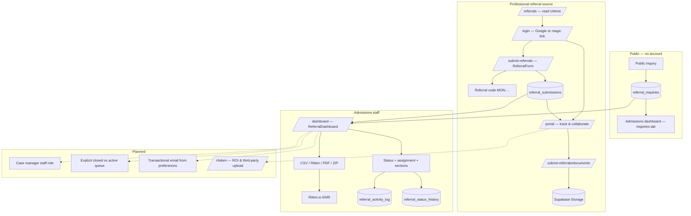
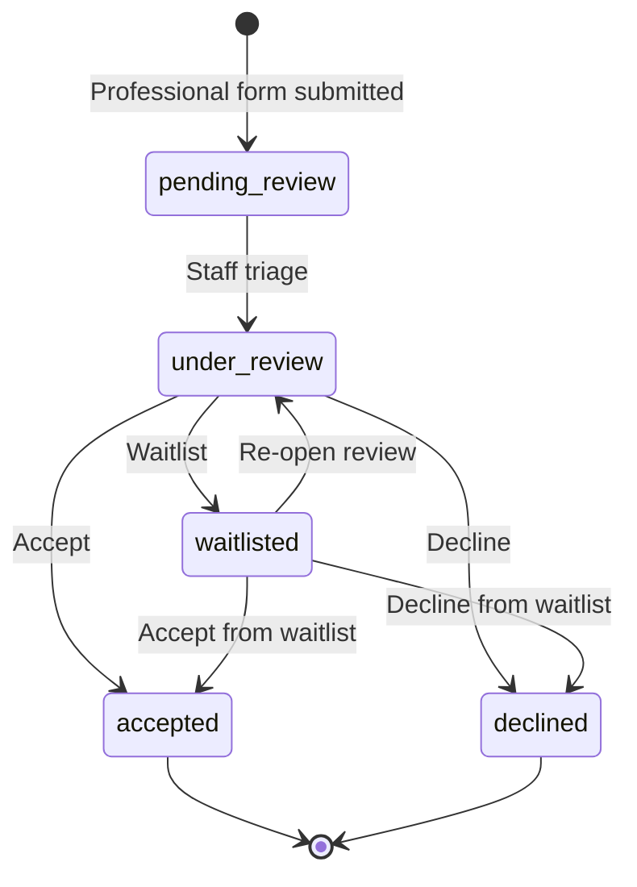
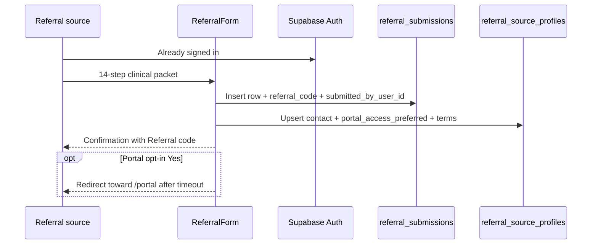
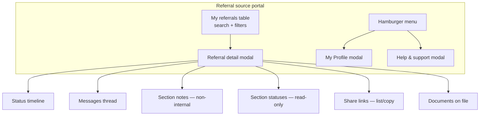
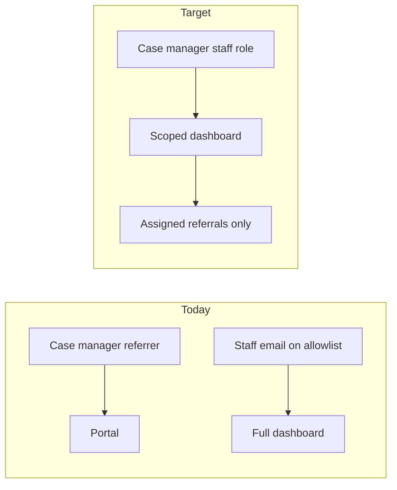
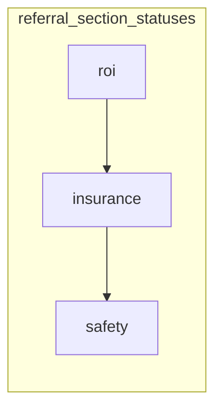

# Referral lifecycle — end-to-end reference

Living document for how referrals move from **first contact** through **referral source tracking** and **admissions operations**. Use this for onboarding, product planning, and Framer/site copy.

**Status legend**

| Label | Meaning |
|--------|---------|
| **Working** | Shipped in repo (`Code/Framer/*.tsx`) and wired to Supabase; paste into Framer to deploy |
| **In progress** | Partially built, in staging, or blocked on policy/RLS/legal |
| **Planned** | Designed or on backlog; not production-ready |

**Related docs:** [`SITE_REFERRAL_AND_PORTAL_FLOW_REFERENCE.md`](SITE_REFERRAL_AND_PORTAL_FLOW_REFERENCE.md) (paths & copy), [`REFERRAL_SOURCE_PORTAL.md`](REFERRAL_SOURCE_PORTAL.md) (portal spec), [`REFERRAL_PORTAL_AND_ADMISSIONS_DASHBOARD_CHECKLISTS`](REFERRAL_PORTAL_AND_ADMISSIONS_DASHBOARD_CHECKLISTS) (P0–P2 backlog), [`REFERRAL_LIFECYCLE_AND_ADMISSIONS_CLOSURE_NOTES.md`](REFERRAL_LIFECYCLE_AND_ADMISSIONS_CLOSURE_NOTES.md) (closure/PHI), [`ADMIN_CMS_AND_HELP_FAQ_REFERENCE.md`](ADMIN_CMS_AND_HELP_FAQ_REFERENCE.md) (future staff roles).

---

## 1. Actors and entry points

| Actor | Signs in? | Primary surfaces | Sees |
|--------|-----------|------------------|------|
| **Public visitor** (self/family/general) | No | Homepage, `/referrals`, `/contact` | Marketing + **Public inquiry** |
| **Professional referral source** (attorney, probation, **case manager as referrer**, facility staff, etc.) | Yes — Google or email magic link | `/login` → `/portal`, `/submit-referrals`, document upload | **Own** referrals only (RLS) |
| **Admissions staff** | Yes — `@monarchcompetency.com` | `/admin` → `/dashboard` | Program-scoped submissions + all inquiries (today: domain gate + allowlist ops) |
| **Case manager (internal staff)** | *Planned* | Same dashboard, restricted | *Planned:* assigned referrals only, read-mostly + messaging |
| **Third party** (guardian, emergency contact, collateral) | No account | `/r?token=…` (ROI signing) | **Working** for ROI via staff-issued link + DOB gate; upload-only token **planned** |

**Deployment note:** Production site is still **Wix**; the **Framer** rebuild (this repo) is the target stack but **not live** yet.

---

## 2. Master lifecycle (high level)



---

## 3. Identifiers (what everyone calls a “referral”)

| Label (site copy) | Database | Who uses it |
|-------------------|----------|-------------|
| **Referral code** | `referral_submissions.referral_code` | Referral sources — confirmation, upload flow, emails |
| **Staff case reference** | `referral_submissions.admin_ref_id` | Admissions only — desk work, exports |
| *(internal)* | `referral_submissions.id` (UUID) | Engineering, storage paths, RLS |

See [`SITE_REFERRAL_AND_PORTAL_FLOW_REFERENCE.md`](SITE_REFERRAL_AND_PORTAL_FLOW_REFERENCE.md) § Referral identifiers.

---

## 4. Overall referral status (professional submissions)

Shared enum on `referral_submissions.status` (dashboard + portal):

| Status | Typical meaning (operations) |
|--------|------------------------------|
| `pending_review` | Submitted; awaiting initial triage |
| `under_review` | Actively worked by admissions |
| `accepted` | Positive outcome / moving toward admit (not yet a separate “on site” closure) |
| `declined` | Not proceeding |
| `waitlisted` | In queue; not closed |

**Working:** Status dropdown on dashboard; portal shows badge + simplified **3-step progress** (Submitted → Under review → Outcome). Changes write to **`referral_status_history`** via DB trigger.

**Planned:** Distinct **lifecycle closure** (admitted on site vs declined vs waitlisted still active) so portal can show “closed” vs “active queue” without overloading one field — see [`REFERRAL_LIFECYCLE_AND_ADMISSIONS_CLOSURE_NOTES.md`](REFERRAL_LIFECYCLE_AND_ADMISSIONS_CLOSURE_NOTES.md).



---

## 5. Flow A — Public inquiry (parallel path)

**Not** the same record type as a professional referral.

```mermaid
sequenceDiagram
    participant V as Visitor
    participant F as PublicInquiryForm
    participant DB as referral_inquiries
    participant S as Admissions staff

    V->>F: Short form (no login)
    F->>DB: Insert inquiry
    Note over F,DB: Email to hello@ — edge function exists; wire in Framer when ready
    S->>DB: Dashboard Inquiries tab
    S->>S: Status update / archive
```

| Step | Status |
|------|--------|
| Form on site (`PublicInquiryForm`) | **Working** |
| Stored in `referral_inquiries` | **Working** |
| Admissions **Inquiries** tab (view, status, archive, CSV export) | **Working** |
| Email to `hello@monarchcompetency.com` | **Planned** ([`FORM_EMAILS.md`](FORM_EMAILS.md)) |
| Convert inquiry → full referral | **Planned** (manual process today) |

---

## 6. Flow B — Referral source: sign-in through tracking

### 6.1 Authentication

```mermaid
flowchart LR
    A[Visitor on /referrals] --> B[CTA Submit a referral]
    B --> C[/login AuthGateway]
    C --> D{Email domain?}
    D -->|@monarchcompetency.com| E[/dashboard staff]
    D -->|Other| F[/portal source]
```

| Capability | Status |
|------------|--------|
| Google OAuth | **Working** |
| Email magic link | **Working** |
| Staff vs source routing by domain | **Working** |
| Password / 2FA | **Planned** |
| Pre-approved allowlist for sources | **Planned** (policy option) |

### 6.2 Submit professional referral



| Step | Status |
|------|--------|
| Multi-step `ReferralForm` | **Working** |
| Link submission to `auth.users` (`submitted_by_user_id`) | **Working** |
| Auto **referral code** (`MON-…`) | **Working** |
| **Staff case reference** (`admin_ref_id`) | **Working** (DB trigger) |
| Portal access opt-in + terms (`portal_access_opt_in`, profile prefs) | **Working** |
| Program routing (`current_program_id`, etc.) | **Working** (Competency backfill; multi-program UX evolving) |

### 6.3 Portal — track and collaborate

**Route:** `/portal` · **Component:** `ReferralSourcePortal.tsx`



| Feature | Status |
|---------|--------|
| List own referrals (RLS) | **Working** |
| Search + status filters | **Working** |
| Program + **Assigned to** columns | **Working** |
| Detail modal: status, timeline, documents | **Working** |
| **Messages** with admissions | **Working** |
| **Section notes** (source-visible) | **Working** |
| **Section workflows** (ROI / Insurance / Safety) | **Working** (read-only in portal) |
| **Share links** — view/copy existing | **Working** |
| **Share links** — create from portal | **Planned** (staff creates; source views/copies) |
| **ROI signing** (`/r?token`, DocuSeal v2.2) | **Working** |
| **Document requests** (batches + items) | **Working** |
| **My Profile** — contact + notification toggles | **Working** |
| **Help & support** modal (FAQ, quickstart) | **Working** |
| Profile **deactivate** | **Working** |
| Portal home / stat cards (“Pending”, “Action needed”) | **Planned** (Phase 2D spec) |
| “New” badge for unread staff messages/notes | **Working** |
| Detail modal **X** close button (Framer embed quirk) | **In progress** — backdrop close works |
| Full table **mirror** of admissions filters/actions | **Planned** (P2 checklist) |
| Edit own submission after submit | **Planned** (policy + RLS + audit) |

### 6.4 Post-submit document upload

**Route:** `/submit-referrals/documents` · **Component:** `DocumentUploadForm.tsx`

| Rule | Status |
|------|--------|
| Must sign in | **Working** |
| Requires **referral code** + **email** matching `referral_source_email` on row | **Working** |
| Third party **ROI** via staff-issued link | **Working** (`/r?token`, DOB + DocuSeal) |
| Third party **upload** with only the code | **Planned** (`document_upload` link type) |

**Important:** Do not promise “send the code to family and they can upload” until tokenized share pages ship — see [`SITE_REFERRAL_AND_PORTAL_FLOW_REFERENCE.md`](SITE_REFERRAL_AND_PORTAL_FLOW_REFERENCE.md) § Third-party / ROI gap.

### 6.5 Notification preferences (source)

Stored in `referral_source_profiles.notification_preferences` (toggles in My Profile):

- Status changes  
- New messages  
- ROI signed  
- Document uploads  
- Weekly summary  

| | Status |
|---|--------|
| UI toggles + DB storage | **Working** |
| Automated email respecting toggles | **Planned** |

---

## 7. Flow C — Admissions staff workflow

**Route:** `/dashboard` · **Component:** `ReferralDashboard.tsx`  
**Gate:** Supabase auth + `@monarchcompetency.com` (fine-grained allowlist is operational, outside code).

```mermaid
flowchart TB
    subgraph dash [Admissions dashboard]
        TABS[Submissions | Inquiries]
        GRID[Submissions table<br/>filter sort assign export]
        MODAL[Submission detail modal]
        PROF[My profile modal]
        HELP[Help & support modal]
        GRID --> MODAL
    end

    MODAL --> ST[Change overall status]
    MODAL --> ASG[Assign / unassign staff]
    MODAL --> ROI[Section statuses ROI Insurance Safety]
    MODAL --> INT[Internal section notes]
    MODAL --> MSG[Messages]
    MODAL --> SL[Share links create revoke]
    MODAL --> ACT[Activity timeline]
    MODAL --> ARCH[Archive / unarchive]
    GRID --> EXP[Batch export]
```

### 7.1 Submissions list

| Feature | Status |
|---------|--------|
| Load `referral_submissions` scoped by `staff_program_memberships` | **Working** |
| Sort by `last_activity_at` then `created_at` | **Working** |
| View-only portal opens do **not** bump sort (`referral_viewed`) | **Working** |
| Filters (status, assignee, program, search, etc.) | **Working** |
| **Program** + **Assignee** columns | **Working** |
| Urgent / compact table layouts (tablet/desktop) | **Working** |
| Archive / unarchive (row + batch) | **Working** |
| Exports: full CSV, **Ritten CSV**, print/PDF, ZIP attachments | **Working** |
| Explicit “Submitted date” vs “Last activity” column toggle | **Planned** (optional UX) |

### 7.2 Submission detail (operational cockpit)

| Feature | Status |
|---------|--------|
| Full clinical payload + documents | **Working** |
| Status dropdown → `referral_status_history` | **Working** |
| **Assign to me** / unassign | **Working** |
| Assignee directory for portal (`admissions_staff_profiles` + RPC) | **Working** |
| **Activity log** (status, messages, notes, share links, views) | **Working** |
| **Messages** with referral source | **Working** |
| **Section notes** (+ internal-only) | **Working** |
| **Section workflows** (ROI, Insurance, Safety) — staff edit | **Working** |
| **Share links** — create / copy / revoke | **Working** |
| **My profile** (display name, title, phone, SMS opt-in field) | **Working** |
| **Help & support** modal | **Working** |
| Tooltips on dense controls | **Planned** (wishlist) |

### 7.3 Inquiries tab

Lighter records from public inquiry — separate pipeline from `referral_submissions`.

| Feature | Status |
|---------|--------|
| List / detail / status / archive | **Working** |
| Link inquiry to new professional referral | **Planned** (manual today) |

---

## 8. Flow D — Case managers (two meanings)

### 8.1 Case manager **as referral source** (external)

A **case manager at a hospital, court, or agency** who submits on behalf of clients.

- Selects role/affiliation on **ReferralForm**  
- Same lifecycle as §6 (login → submit → portal)  
- **Working** today

### 8.2 Case manager **as internal Monarch staff** (future)

From [`ADMIN_CMS_AND_HELP_FAQ_REFERENCE.md`](ADMIN_CMS_AND_HELP_FAQ_REFERENCE.md) — **not implemented** as RBAC yet:

| Intended capability | Status |
|-------------------|--------|
| Read referrals **assigned to them** only | **Planned** |
| Print / download / export **assigned** rows | **Planned** |
| Message referral sources on assigned cases | **Planned** |
| No program transfer / broad mutations | **Planned** |
| Enforced via `permissions` + RLS + `user_roles` | **Planned** (MVP bundles: Admissions staff, Case manager, Super admin) |

Until shipped, case managers who are employees use the **full admissions** experience if their email is on the staff allowlist.



---

## 9. Collaboration & audit layer (shared)

These tables back both portal and dashboard:

| Table / mechanism | Purpose | UI |
|-------------------|---------|-----|
| `referral_status_history` | Status timeline | **Working** both sides |
| `referral_activity_log` + `log_referral_activity` RPC | HIPAA audit + activity feed | **Working** |
| `referral_messages` | Thread per referral | **Working** |
| `referral_section_notes` | Per-section notes (`is_internal`) | **Working** |
| `referral_section_statuses` | ROI / Insurance / Safety substates | **Working** (staff edit, portal read) |
| `referral_share_links` | Tokenized third-party access | **Working** — staff CRUD; ROI public page **`/r?token`**; upload-only **planned** |
| `referral_source_profiles` | Source contact + notification prefs | **Working** |
| `admissions_staff_profiles` | Published assignee contact in portal | **Working** |

---

## 10. Section workflows (parallel to overall status)

Overall status = intake decision track. **Section statuses** = operational checklist on the same referral.



| | Portal | Dashboard |
|---|--------|-----------|
| View section status | **Working** | **Working** |
| Change section status | — | **Working** |

---

## 11. Program & multi-site direction

| Milestone | Status |
|-----------|--------|
| M1 corporate client + `programs` (Competency, MH, Sober Living, Launch) | **Working** (migrations applied) |
| M2 `staff_program_memberships` | **Working** |
| M3 `current_program_id` on submissions | **Working** |
| Dashboard filter by staff programs | **Working** |
| M4 `referral_transfers` immutable history | **Planned** |
| M6 program-aware RLS on submissions | **Planned** (after policy design) |
| Unified portal across all Monarch sites (one login, all programs) | **Planned** (strategy in checklist) |
| Per-program Framer sites + shared Supabase | **In progress** (Competency first) |

---

## 12. Security & compliance backlog

| Item | Status |
|------|--------|
| RLS on `referral_submissions` (source + staff) | **Working** |
| RLS on several tables (`referral_inquiries`, `referral_status_history`, `programs`, …) | **In progress** — design policies before enable |
| HIPAA audit logging + retention migrations | **Working** (DB); review policies with legal |
| Portal visibility after admit / EMR handoff | **Planned** — legal + [`REFERRAL_LIFECYCLE_AND_ADMISSIONS_CLOSURE_NOTES.md`](REFERRAL_LIFECYCLE_AND_ADMISSIONS_CLOSURE_NOTES.md) |
| Migration workflow (`supabase db push`, 14-digit versions) | **Working** |

---

## 13. Integrations & outbound

| Integration | Role | Status |
|-------------|------|--------|
| **Ritten.io** | EMR import via dashboard CSV export | **Working** (mapping spec in `docs/RITTEN_CSV_EXPORT_*`) |
| **Resend** | Contact form email (`monarch-contact-form` edge function) | **Working** (function exists) |
| Referral transactional email | Status/message/ROI/upload/summary | **Planned** |
| **BuildShip** | API workflows (per `PROJECT.md`) | **Planned** / ancillary |
| **DocuSeal** | ROI v2.2 (template 3756335) | **Working** (`monarch-roi-signing-session`, webhook, `ReferralSharePage`) |

---

## 14. Future objectives (consolidated backlog)

Grouped by theme; see checklists for P0–P2 ordering.

### Product — referral source

- [x] Public **ROI signing** `/r?token` (DocuSeal, DOB gate)  
- [ ] Public **upload-only** share pages (`document_upload` link type)  
- [ ] Portal **create** share links + collateral invites  
- [ ] Portal **dashboard home** (stats, recent activity)  
- [ ] **Edit own referral** post-submit (typos, missing fields) with audit  
- [ ] **In-portal “ask a question”** without opening a referral  
- [ ] Wire **notification emails** to profile toggles  

### Product — admissions

- [ ] **Case manager** staff role (assigned-only, read-mostly + message)  
- [ ] **Admin `/admin` shell** — role assignment + CMS for help/FAQ/banners ([`ADMIN_CMS_AND_HELP_FAQ_REFERENCE.md`](ADMIN_CMS_AND_HELP_FAQ_REFERENCE.md))  
- [ ] **Lifecycle closure** column or phase distinct from `status`  
- [ ] **Program transfer** UI + `referral_transfers` history  
- [ ] Optional sort control: submitted vs last activity  
- [ ] Help content: SOP download, desk phone, finalized FAQ from training  

### Platform

- [ ] **M6** program-scoped RLS  
- [ ] Tighten RLS on unprotected tables  
- [ ] **Multi-program** portal (tabs/filters; one identity per email)  
- [ ] Sober Living / other program **referral forms** (separate specs)  
- [ ] Framer site **go-live** (replace Wix)  

### Compliance & copy

- [ ] Counsel sign-off on **post-admit portal visibility**  
- [ ] Site copy aligned with **third-party upload** reality  
- [ ] DB-driven help/FAQ (reduce Framer redeploys)  

---

## 15. Component map (source of truth)

| Surface | File | Auth |
|---------|------|------|
| Login router | `Code/OAuth/AuthGateway.tsx` | All |
| Public inquiry | `Code/Framer/PublicInquiryForm.tsx` | None |
| Professional referral | `Code/Framer/ReferralForm.tsx` | Source |
| Document upload | `Code/Framer/DocumentUploadForm.tsx` | Source |
| Referral source portal | `Code/Framer/ReferralSourcePortal.tsx` | Source |
| Admissions dashboard | `Code/Framer/ReferralDashboard.tsx` | Staff domain |

After edits: `npm run typecheck` → paste updated TSX into Framer.

---

## Changelog

| Date | Change |
|------|--------|
| 2026-05-28 | ROI signing live; document requests; onboarding docs `ADMISSIONS_STAFF_ONBOARDING_AND_SOP.md`, `REFERRAL_SOURCE_ONBOARDING.md`. |
| 2026-05-15 | Initial E2E reference: lifecycle diagrams, working/in-progress/planned matrix, case manager distinction, links to existing specs. |
