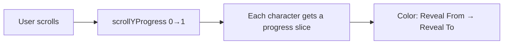

# Sefe Scroll Revealer

Per-character scroll color reveal for Framer. Text starts in a **lighter color** and transitions to a **darker color** as the user scrolls — one character at a time, left to right.

**Component file:** [`Code/Framer/Workshop/SefeScrollRevealer.tsx`](../Code/Framer/Workshop/SefeScrollRevealer.tsx)

## Install in Framer

1. In Framer → **Assets** → **Code**, create a new file (e.g. `SefeScrollRevealer.tsx`).
2. Paste the full contents of `SefeScrollRevealer.tsx`.
3. Drop the component on the canvas and configure via the property panel.

No sibling imports — everything is self-contained for Framer paste.

## How it works

- Scroll progress is mapped across **all words** in the text block.
- Within each word, progress is subdivided per **character**.
- On the canvas / in static preview, all characters render at **Reveal To** so layout is readable while editing.

## Property controls

### Text

| Control | Description |
|--------|-------------|
| **Text** | Content. Use line breaks (`Enter`) for multiple lines. |

### Reveal colors

| Control | Default | Description |
|--------|---------|-------------|
| **Reveal From** | `#ACABA9` | Initial light/muted color (unrevealed state). |
| **Reveal To** | `#20201F` | Final dark color (fully revealed). |

### Blur

| Control | Default | Description |
|--------|---------|-------------|
| **Blur** | Off | Blur unrevealed text ahead of the scroll reveal front. |
| **Blur Intensity** | `10px` | Max blur radius (0–24px). |
| **Blur Lead** | By unit | **By unit** — lead distance in characters/words/sentences. **By % ahead** — lead as % of total text length. |
| **Lead Unit** | Word | Character, Word, or Sentence (line). Shown when Blur Lead is *By unit*. |
| **Lead Amount** | `1` | How many units ahead blur reaches full intensity (e.g. 1 word, 3 characters). |
| **Lead %** | `25%` | 10% / 25% / 50% / 100% of characters ahead of reveal front. Shown when Blur Lead is *By % ahead*. |

Blur ramps from **0 at the reveal front** to **full intensity** over the lead distance, then eases to **0 when each character finishes revealing** — no blur wake on already-sharp text.

Example: **Lead Unit = Word**, **Lead Amount = 1** → roughly one word of fuzzy text sits ahead of the sharp reveal line; trailing text stays legible once revealed.

### Typography

| Control | Description |
|--------|-------------|
| **Typography** | `Project Style` — links to Assets → Typography (updates on republish). `Manual` — Framer **Font** control. |
| **Style** | Project text style picker (Body ML, Heading 3, etc.). Shown in Project Style mode only. |
| **Font** | Framer Font picker (family, size, **weight variant**, line height). Manual mode only. |
| **Letter Spacing** | Tracking in `em` (−0.2 to 0.5, step 0.005). Always available — overrides preset tracking in Project Style. |

Per-character scroll reveal uses `inline-block` spans, so letter spacing is applied via **margin between characters** (not CSS `letter-spacing` on the parent, which does not affect split spans).

**Project Style** applies Framer `framer-styles-preset-*` classes. Font weight comes from the linked style. **Reveal From / Reveal To** still control scroll animation colors.

### Layout & scroll

| Control | Default | Description |
|--------|---------|-------------|
| **Align** | Left | Line alignment (flex justify). |
| **Pre-revealed Chars** | `0` | Characters before this index start at **Reveal To** (skip animation for leading text). |
| **Scroll Start** | `0.85` | Viewport offset when reveal begins (`useScroll` offset, 0–1). |
| **Scroll End** | `0.35` | Viewport offset when reveal completes. |

Lower **Scroll End** than **Scroll Start** means the animation runs as the block moves up through the viewport (typical for scroll-in reveals).

## Monarch text styles

When using **Project Style**, these paths are available:

| Style | Assets path |
|-------|-------------|
| Body ML (L) | `/Body/Body ML` |
| Body M | `/Body/Body M` |
| Heading 3 | `/Headings/Heading 3` |
| Heading 4 | `/Headings/Heading 4` |
| Eyebrow | `/Headings/Eyebrow` |
| Subheading 6L | `/Headings/Subheading 6L` |

If you add or rename styles in Assets, update the `MONARCH_TEXT_STYLE_PRESETS` array at the top of the component (preset class hashes are project-specific).

## Differences from the original snippet

The previous inline version (formerly stored in this doc) had several limitations:

| Issue | Fix |
|-------|-----|
| Hardcoded `#ACABA9` / `#20201F` | **Reveal From** and **Reveal To** color controls |
| Font family as plain string + broken Google Fonts `wght@400` inject | **Project Style** presets or **Manual** fields; no runtime font injection |
| Font weight 400–700 only | Full weight enum 300–800 in Manual mode |
| Hardcoded `#573337` on paragraph | Removed — color is per-character reveal only |
| `paragraphAlign` default `"Left"` vs options `flex-start`… | Fixed **Align** enum (`left` / `center` / `right`) |
| No multi-line support | Line breaks create separate flex rows |
| `duration` / `easing` on `motion.span` (no effect with `useTransform`) | Removed — timing is driven by scroll offsets |

## Related components

- [`ScrollText.tsx`](../Code/Framer/Workshop/ScrollText.tsx) — word fade/slide on scroll; project typography linking.
- [`monarchTextStylePresets.ts`](../Code/Framer/Workshop/monarchTextStylePresets.ts) — shared preset map reference for the repo.

## Quick presets (Monarch)

**Blueprint body copy (Our Program):**

- Typography: Project Style → Body ML (L)
- Reveal From: `#ACABA9` or `rgba(233, 237, 246, 0.45)` on dark sections
- Reveal To: `#F8F6F1` (shell) or `#2B2828` (ash) on light sections
- Scroll Start: `0.85`, Scroll End: `0.35`

**Large headline reveal:**

- Typography: Project Style → Heading 3
- Reveal From: `rgba(43, 40, 40, 0.25)`
- Reveal To: `#2B2828`
