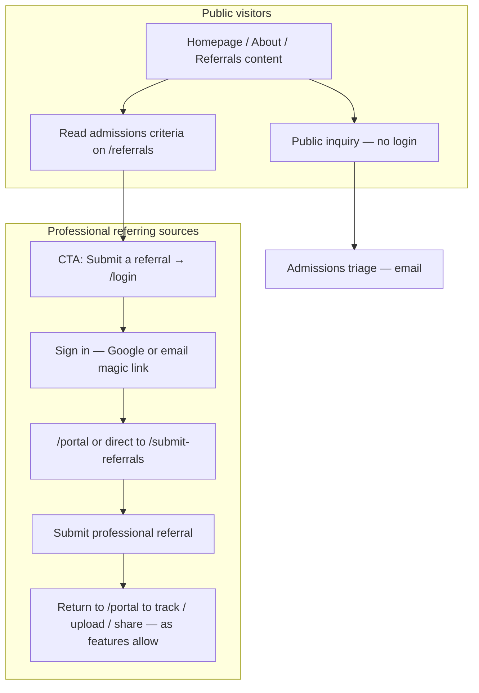

# Site referral & portal flow — content reference

Living document for website copy, IA, and CTAs. Update as forms, portal, and share-link features ship.

---

## Glossary

- **IA (information architecture):** How pages, sections, and paths are organized so visitors find the right action (inquiry vs referral vs login) without confusion.

- **Public inquiry:** Short, no-login path for general questions or “first contact.” Not a full clinical referral.

- **Professional referral:** Full referral submitted by a credentialed or organizational referrer after sign-in. Tied to Supabase auth and (over time) the referral source portal.

---

## Referral identifiers — database vs site copy (authoritative naming)

Use these labels consistently on the website, in emails, and in the portal. **No code or schema changes** are implied here—this is vocabulary only.

| Site label | Database | Typical shape | Who sees it |
|------------|----------|---------------|-------------|
| **Referral code** | `referral_submissions.referral_code` | `MON-` + short alphanumeric (e.g. `MON-A4K7`) | Referring professionals (confirmation screen, emails, document upload flow, future collateral instructions). |
| **Staff case reference** | `referral_submissions.admin_ref_id` | `REF-MC-` + sequential number (e.g. `REF-MC-001`) | **Admissions / staff only** (dashboard, exports, internal comms). Do not use as the primary ID you give to third parties. |
| *(do not surface in marketing)* | `referral_submissions.id` | UUID | Internal primary key only—API, RLS, storage paths, engineering. |

**Why two human-readable IDs?** The **referral code** is random per submission and safe to share with the submitting organization for “find this file again” workflows. The **staff case reference** is sequential and optimized for **internal** tracking and desk work.

---

## Canonical paths (as agreed)

| Path | Role |
|------|------|
| **`/`** (homepage) | Hero + mid-page CTAs; **Public inquiry** remains in the **lower section** of the homepage. |
| **`/about`** | Secondary CTA placement: bottom of page. |
| **`/referrals`** | Program/admissions guidance and criteria; **no tabs** for audiences on one page — **sequenced content**: (1) guidance, (2) professional CTA → **`/login`**, (3) “Inquiring for yourself or a loved one?” → **Public inquiry** (`PublicInquiryForm`) **after** all referral/admission content. |
| **`/login`** | **Referral partner** sign-in (Google + email magic link; default bucket `source`). Not for staff nav links. |
| **`/admin`** | **Staff** sign-in only (same AuthGateway component; bucket `staff`). **Not** in public nav — bookmark / internal URL. `@monarchcompetency.com` → **`/dashboard`** after auth (provisioned allowlist at go-live). |
| **`/portal`** | Authenticated referral sources: list/track/manage their submissions (evolving feature set). |
| **`/submit-referrals`** | Professional referral form (requires auth first — see below). |
| **`/submit-referrals/documents`** | Document upload for an **existing** referral (auth + verification — see **Third-party / ROI gap** below). |
| **`/contact`** | Standard “info” form → same admissions inbox as configured (alongside any other contact channels). |

**Live (ROI signing):**

- **`/r?token=…`** — public ROI signing page (`ReferralSharePage.tsx`). Framer uses a static `/r` route; the token is passed as a query parameter. Signer verifies **date of birth**, then completes **DocuSeal** embed (template v2.2). Staff create links from the dashboard; sources can view/copy links in the portal. See `docs/REFERRAL_SOURCE_ONBOARDING.md` §4 and `docs/ROI_SIGNING_UX_AND_TEMPLATE_V2_2.md`.

---

## Audience split (high level)

---

## Flow 1 — Public inquiry (self / family / general)

**Intent:** Lower barrier; not a full referral packet; no PHI workflow commitment on the visitor’s side beyond what they choose to type.

| Step | What happens |
|------|----------------|
| 1 | Visitor reads site content (homepage lower section, or **`/referrals`** after professional section, or **`/contact`**). |
| 2 | Completes **Public inquiry** — **no account, no login**. |
| 3 | Submission goes to admissions (same pipeline as you configure for contact/info forms). |

**Copy note:** Make clear this is for **questions / initial interest**, not the same as a **professional referral** and not the staff-only clinical packet path.

---

## Flow 2 — Professional referral source (submit + manage)

**Intent:** Identified, authenticated submitter; submissions tied to their account for portal, audit, and follow-up.

| Step | What happens |
|------|----------------|
| 1 | Lands on **`/referrals`** (or homepage → referrals). Reads program and admission requirements. |
| 2 | CTA **“Submit a referral”** → **`/login`**. |
| 3 | **`/login`**: **Continue with Google** or **Continue with email** (magic link to inbox; link returns user to the login URL configured in Supabase). |
| 4 | After auth: non-staff users are routed to **`/portal`** (or your chosen post-login path before opening the form). |
| 5 | From portal or direct navigation, opens **`/submit-referrals`** and completes **Professional referral** form. |
| 6 | For **returning** management: **`/login`** again → **`/portal`** to see status, documents, and (when built) share links and messages. |

**Exception:** None for “submit without auth” — professionals **always sign in before** submitting or managing active referrals (matches `ReferralForm` behavior).

---

## Flow 3 — Staff (`@monarchcompetency.com`)

| Step | What happens |
|------|----------------|
| 1 | **`/admin`** (staff sign-in; not linked from public site). |
| 2 | Redirect to **admin dashboard** (`/dashboard`). |
| 3 | **Second layer:** your org restricts **which** staff emails may use the dashboard (allowlist / admin provisioning). AuthGateway splits sessions by bucket; **fine-grained staff access** is your operational control. |

---

## `/referrals` vs `/login` (for copy)

| | **`/referrals`** | **`/login`** |
|--|------------------|----------------|
| **Purpose** | Educate; separate **public inquiry** from **professional** path; build trust before PHI. | **Identity** — who is submitting or returning. |
| **Forms** | **PublicInquiryForm** at bottom (after guidance). No professional referral form embedded here if your CTA sends pros to login first. | **AuthGateway** only — no long inquiry form. |
| **Who** | Everyone. | Anyone who needs an account session (professionals returning; first-time pros before first referral). |

**One-line positioning:** *“Learn here; sign in to submit or continue a professional referral.”*

---

## Referral source portal (`/portal`) — content reference

**Purpose (for professionals):** A **secure, personal workspace** tied to the email (and user id) they used to sign in. They see **only their own** referrals (enforced in the backend). As features roll out, the portal is the right place to describe:

- **My referrals / dashboard:** counts, filters, “action needed” states (as implemented).
- **Referral detail:** status, timeline/history, documents on file (as implemented).
- **Uploads:** additional documents after submission (paths may combine portal actions with **`/submit-referrals/documents`** — keep Framer routes aligned with components).
- **Share links / ROI signing:** view and copy links staff created; open **Sign ROI** when an active ROI link exists.
- **Document requests:** structured batches from admissions (types, due date, ROI required).
- **Messages** with admissions; **section notes** (source-visible); **activity** via timeline.

**Difference from “just using `/referrals`”:** `/referrals` is **marketing + public inquiry**. `/portal` is **post-login operations** for the same professional audience.

---

## Login — FAQs for copy

### Can anyone with a non-`@monarchcompetency.com` email use `/login` if they have never submitted a referral?

**Technically today:** Yes. Supabase will create/sign in a user; they are sent to **`/portal`**, which may show **zero referrals** until they submit one.

**Policy choice for copy:**

- **Option A (permissive):** “Sign in to start your first referral or to return to your submissions.”
- **Option B (restrictive messaging only):** “Sign in if you are a professional referral source” — does not block personal Gmail at the gate unless you add product rules later.

Recommend **Option A** unless you implement an allowlist for referral sources.

### Magic links, passwords, 2FA

- **Today (typical Supabase):** Email **magic link** (OTP link) and **Google OAuth** on `/login`. Supabase also supports **password** users if you enable and build that UI; it is **not** the default in the current AuthGateway-focused flow.
- **“After first login, password or OTP”:** Reasonable **roadmap** copy: “You can sign in with Google or a one-time email link.” Do not promise password + 2FA until those flows are implemented and tested.
- **Staff:** Admin dashboard already documents **magic link restricted to your domain** for staff paths; combine with your **allowlist** for who may access dashboard features.

### Manual user creation vs self-serve magic link

| Approach | Security | Operations |
|----------|----------|------------|
| **Manual create every referral source** | High control, high friction; easy to become outdated. | Poor at scale. |
| **Self-serve magic link + RLS so users only see their rows** | Industry standard; identity verified by **email inbox**; combine with **staff allowlist** for admin. | Low friction; aligns with current architecture. |
| **Optional “request access” form** | Adds a human gate before you add them to an allowlist — only needed if you **must** pre-approve every org. | Use if compliance requires known roster before first login. |

**Suggestion:** Do **not** manually create all referral source users unless compliance demands it. Use **magic link (and optionally Google)** for referral sources; use **domain + allowlist** for staff dashboard. Add **“request access”** only if legal/compliance requires a closed roster.

### Why anyone mentioned discouraging `@gmail.com`

Only if you need **strong organizational identity** (e.g. “must match `@state.co.us`”). Your staff using Google Workspace under your domain is unrelated. **No requirement** to discourage Gmail unless policy says so.

---

## Third-party / ROI / collateral — current behavior (2026-05)

Full source-facing copy: **`docs/REFERRAL_SOURCE_ONBOARDING.md`**. Staff SOP: **`docs/ADMISSIONS_STAFF_ONBOARDING_AND_SOP.md`** §2.6–2.8.

### Intended story (probation officer → client / representative)

1. Officer submits a **professional referral** (signed in).
2. Admissions (or officer forwarding a staff-issued link) requests a **signed ROI** from someone who is **not** the referring login (client, guardian, legal rep).
3. Signer completes ROI at **`/r?token=…`** (DOB gate + DocuSeal v2.2); PDF stores on the same referral; portal and dashboard show progress.

### What works today

| Path | Who | How |
|------|-----|-----|
| **ROI signing link** | Third-party signer | Staff creates **ROI signing** share link → URL `/r?token=…` → DOB match → DocuSeal embed → webhook stores PDF |
| **Referring source upload** | Same email as on referral | Sign in → portal upload or `/submit-referrals/documents` (referral code + email) |
| **Document request** | Referring source | Staff sends batch in dashboard; source fulfills in portal (upload + ROI link when flagged) |
| **Staff upload** | Admissions | Manual attach per operational policy |

### What is still limited

- **Upload-only token** for third parties (no login, not ROI) — `link_type = document_upload` is schema-ready; public page **planned**.
- **Portal create share link** — staff creates today; source **views/copies** in portal.
- **Transactional email** for ROI/document requests — toggles exist in My Profile; automated send **planned**.

### Copy rules for `/referrals` and marketing

- **Do** explain that Monarch sends **secure ROI links** to authorized signers and that professionals track status in the **portal**.
- **Do not** promise that anyone with only a **referral code** can upload without a Monarch-issued link or the referring professional’s email.
- **Do** direct families to **public inquiry**, not the professional referral form.

### Optional future paths (not required for current copy)

| Approach | Notes |
|----------|--------|
| Additional e-sign vendors | DocuSeal is production for ROI v2.2; other vendors would be a separate procurement decision |
| Staff-only ROI completion link | Internal fields on template after admit — backlog in `ROI_SIGNING_UX_AND_TEMPLATE_V2_2.md` |

---

---

## CTA map (no code — placement only)

| Location | Primary | Secondary |
|----------|---------|-----------|
| **Homepage** — below hero | Link to **`/referrals`** or contextual “Get started” | **General question** → public inquiry area or **`/contact`** |
| **`/about`** — bottom | Same family as homepage | **General question** as needed |
| **`/referrals`** — after guidance | **Submit a referral** (professionals) → **`/login`** | **Already submitted? Sign in** → **`/login`** |
| **`/referrals`** — lower | **Inquiring for yourself or a loved one?** → scroll to **PublicInquiryForm** | — |
| **Homepage / Contact** | **General question** / info form → admissions | — |

---

## Tone & compliance

- **Public sections:** Plain language; short sentences on `/referrals` before the professional deep dive.
- **Professional / login / portal sections:** May use precise terms (PHI, ROI, authentication, portal) — audience can self-educate.
- **Disclaimers (HIPAA, emergency care, authorization):** None required in this reference file for now; add a **“Legal & clinical disclaimers”** block when counsel provides text.

---

## Changelog (edit when you ship)

| Date | Change |
|------|--------|
| *(initial)* | Separated `/referrals` content order; CTAs; portal vs login; documented third-party upload gap vs intended share-link flow. |
| 2026-05-28 | ROI signing live (`/r?token`); document requests; portal share links; third-party section updated. Source/staff onboarding docs: `REFERRAL_SOURCE_ONBOARDING.md`, `ADMISSIONS_STAFF_ONBOARDING_AND_SOP.md`. |
| *(earlier)* | Authoritative site names for `referral_code` and `admin_ref_id`; initial ROI gap analysis. |
